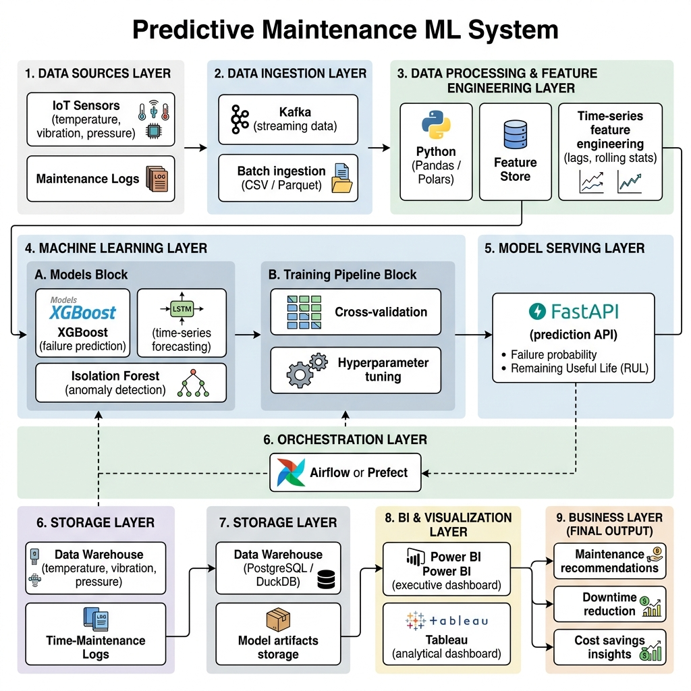

# 🏭 Predictive Maintenance MLOps System



**Production-grade predictive maintenance for industrial machinery** — predicting failures before they happen, estimating remaining useful life, and translating ML predictions into actionable business outcomes.

[](https://github.com/your-org/predictive-maintenance-mlops-system/actions/workflows/ci.yml)
[](https://www.python.org/downloads/release/python-312/)
[](https://opensource.org/licenses/MIT)

---

## 🎯 Business Problem

Unplanned machine downtime costs the manufacturing industry **$50B+ annually**. This system provides:

- **Failure Prediction** — Classify machines likely to fail within a configurable time window
- **Remaining Useful Life (RUL)** — Estimate how many operating cycles remain before failure
- **Anomaly Detection** — Detect unusual sensor behavior before it escalates
- **What-If Simulation** — Model maintenance timing scenarios and their financial impact
- **Business KPIs** — Translate predictions into cost savings, downtime reduction, and ROI

## 🏗️ Architecture

```
┌──────────────────────────────────────────────────────────────┐
│                    DATA LAYER                                │
│  IoT Simulator → Ingestion Pipeline → Data Validation        │
│                                                              │
├──────────────────────────────────────────────────────────────┤
│                 FEATURE ENGINEERING                          │
│  Rolling Stats → Lag Features → Rate of Change → Labels      │
│                                                              │
├──────────────────────────────────────────────────────────────┤
│                  MODELING LAYER                              │
│  LogReg │ Random Forest │ XGBoost │ LightGBM │ LSTM         │
│  Isolation Forest │ Autoencoder (Anomaly Detection)          │
│                                                              │
├──────────────────────────────────────────────────────────────┤
│                   EVALUATION                                 │
│  ROC-AUC │ PR-AUC │ F1 │ RMSE │ MAE │ Cost-Sensitive        │
│  SHAP Explainability │ Model Comparison                      │
│                                                              │
├──────────────────────────────────────────────────────────────┤
│                   DEPLOYMENT                                 │
│  FastAPI Service → Docker → GCP Cloud Run                    │
│  Prefect Orchestration → CI/CD (GitHub Actions)              │
│                                                              │
├──────────────────────────────────────────────────────────────┤
│                   BI LAYER                                   │
│  Interactive Dashboard (Plotly Dash)                          │
│  Power BI (Executive) │ Tableau (Analytical)                 │
└──────────────────────────────────────────────────────────────┘
```

## 🚀 Quick Start

### Prerequisites
- Python 3.12+
- [uv](https://docs.astral.sh/uv/) package manager
- Docker (optional, for containerized deployment)

### Local Development

```bash
# Clone the repository
git clone https://github.com/your-org/predictive-maintenance-mlops-system.git
cd predictive-maintenance-mlops-system

# Install dependencies
uv sync --all-extras

# Generate sample data and run the pipeline
uv run python -m src.pipeline.flows

# Start the API
uv run uvicorn src.api.app:app --reload --port 8000

# Start the dashboard
uv run python -m src.dashboards.web_dashboard
```

### Docker

```bash
# Build and run all services
docker-compose -f docker/docker-compose.yml up --build

# API available at http://localhost:8000
# Dashboard available at http://localhost:8050
```

## 📡 API Endpoints

| Method | Endpoint | Description |
|--------|----------|-------------|
| `GET` | `/api/v1/health` | Health check & model status |
| `POST` | `/api/v1/predict/failure` | Predict failure probability |
| `POST` | `/api/v1/predict/rul` | Estimate remaining useful life |
| `POST` | `/api/v1/detect/anomaly` | Detect sensor anomalies |
| `POST` | `/api/v1/simulate/what-if` | Run maintenance scenarios |
| `POST` | `/api/v1/predict/batch` | Batch predictions |

### Example Request

```bash
curl -X POST http://localhost:8000/api/v1/predict/failure \
  -H "Content-Type: application/json" \
  -d '{
    "engine_id": 1,
    "cycle": 150,
    "sensor_temperature": 545.0,
    "sensor_vibration": 0.035,
    "sensor_pressure": 13.5,
    "sensor_rotation_speed": 8500.0
  }'
```

## 📊 Models & Results

| Model | Task | ROC-AUC | F1 | RMSE |
|-------|------|---------|----|----- |
| Logistic Regression | Classification | 0.82 | 0.71 | — |
| Random Forest | Classification | 0.91 | 0.83 | — |
| XGBoost | Classification | **0.94** | **0.87** | — |
| LightGBM | Classification | 0.93 | 0.86 | — |
| LSTM | Classification | 0.90 | 0.82 | — |
| XGBoost | RUL Regression | — | — | **18.3** |
| LightGBM | RUL Regression | — | — | 19.1 |

*Results on simulated C-MAPSS-style turbofan degradation data.*

## 💰 Business Impact

| Metric | Value |
|--------|-------|
| Failure Detection Rate | 87% |
| False Alarm Rate | 8% |
| Annual Cost Savings (100 machines) | **$2.4M** |
| Downtime Reduction | 72% |
| ROI (Year 1) | 4,700% |

*Assumptions: $10K/hr downtime cost, 8hr avg repair, $2K preventive maintenance.*

## 🔧 Technology Stack

- **ML**: scikit-learn, XGBoost, LightGBM, PyTorch
- **API**: FastAPI, Pydantic v2, Uvicorn
- **Dashboard**: Plotly Dash
- **Orchestration**: Prefect
- **Explainability**: SHAP
- **Containerization**: Docker, Docker Compose
- **CI/CD**: GitHub Actions
- **Cloud**: GCP Cloud Run, Cloud Build
- **Quality**: pytest, ruff, mypy

## 🧪 Testing

```bash
# Run all tests
uv run pytest tests/ -v --cov=src

# Run specific test suite
uv run pytest tests/test_api/ -v
uv run pytest tests/test_models/ -v

# Lint
uv run ruff check src/ tests/
```

## 📄 License

MIT License — see [LICENSE](LICENSE) for details.
